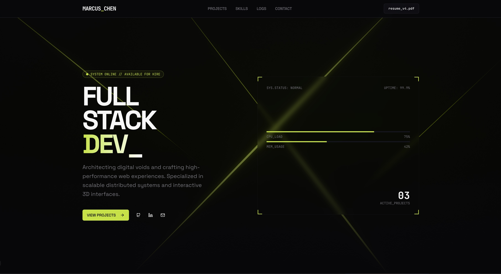

# Michael Jogoh — Developer Portfolio

Personal portfolio site for **Michael Jogoh**, a backend- and full-stack–oriented engineer with DevOps and cloud experience (5+ years). Based in Lagos, Nigeria, and open to remote roles.

Built from the **Devstarter** one-page developer portfolio template by [Zippystarter](https://zippystarter.com), using [Next.js](https://nextjs.org) and [shadcn/ui](https://ui.shadcn.com). The [shadcn template](https://zippystarter.com/templates/devstarter) is compatible with shadcn’s theming system.

To experiment with [shadcn themes](https://zippystarter.com/themes), try the [shadcn theme generator](https://zippystarter.com/tools/shadcn-ui-theme-generator/demo/dev-one?utm_source=https://github.com/zippystarter/template-devone) to preview themes and export them for your own projects.



## Contact

|              |                                                                              |
| ------------ | ---------------------------------------------------------------------------- |
| **Email**    | [michaeljogoh@gmail.com](mailto:michaeljogoh@gmail.com)                      |
| **Phone**    | [+234 703 434 8894](tel:+2347034348894)                                      |
| **GitHub**   | [github.com/Michaeljogoh](https://github.com/Michaeljogoh)                   |
| **LinkedIn** | [Michael Jogoh on LinkedIn](https://linkedin.com/in/michael-jogoh-257778222) |

## Getting Started

Install dependencies (this repo uses **pnpm**; you can swap `pnpm` for `npm` if you prefer):

```bash
pnpm install
```

Start the development server:

```bash
pnpm dev
```

Open [http://localhost:3002](http://localhost:3002) in your browser (port is set in `package.json`).

## Notes

This template uses modern CSS features such as CSS Grid, Subgrid, and `mix-blend-mode`.

## Learn More

- [Zippystarter](https://zippystarter.com) — template source and products
- [shadcn/ui](https://ui.shadcn.com) — component patterns
- [Tailwind CSS](https://tailwindcss.com) — utility-first styling
- [Next.js documentation](https://nextjs.org/docs) — framework features and APIs
